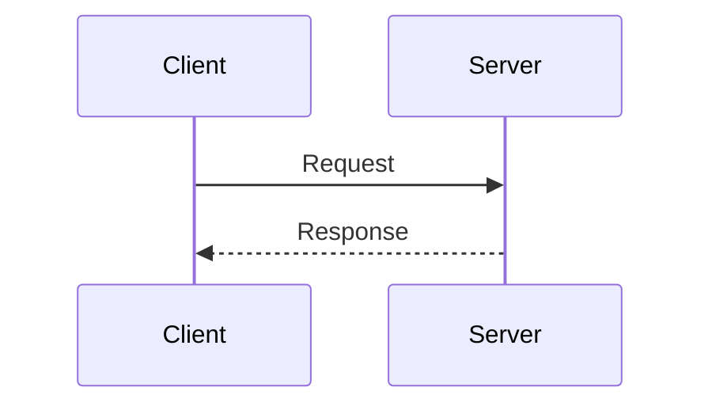
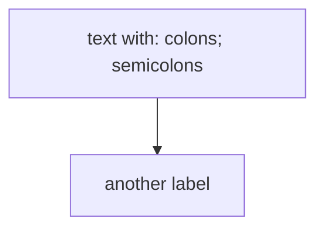

# Markdown Writing Style

## Lists: Use Bullet Points by Default

Prefer bullet points over numbered lists (easier to edit and reorder).

Use numbered lists only when:

- You must reference a specific step later.
- Explicit numbering is required for clarity.

## Breaking Lines at Semantic Boundaries

### Goal

Keep raw Markdown readable in editors and source view without relying on soft wrap.
Assume a typical view width of about 80 to 100 characters.

### Rules

The target is the raw Markdown source, not rendered output in a browser or Markdown viewer.

Generally break lines in raw Markdown at around 80 characters.

Prefer breaking at semantic boundaries to strictly breaking by character count.
Lines may exceed 80 characters but must not exceed 100.

Do not split a short sentence or separate a parenthetical from its phrase
just to stay under 80 characters. Keep the semantic unit on one line.

Exceptions:

- Markdown table.
- Code block.
- Agent Skill frontmatter.

### Example

The following paragraph has **good** line breaks at semantic boundaries:

```
The VAPID key pair we generate proves that the push request comes from your server.
Each push request is signed with the private key,
the push service verifies the signature before delivering.
```

The next paragraph produces the same rendered output,
but the line breaks strictly enforce the 80-character limit,
which is **less readable** in raw Markdown:

```
The VAPID key pair we generate proves that the push request comes from your
server. Each push request is signed with the private key, the push service
verifies the signature before delivering.
```

**Avoid** writing everything on one long line:

```
The VAPID key pair we generate proves that the push request comes from your server. Each push request is signed with the private key, the push service verifies the signature before delivering.
```

## Diagrams: Use Mermaid by Default

Always use Mermaid syntax for diagrams.

Prefer sequence diagrams when they fit the purpose instead of other diagram types.

Example:



### Avoid Common Syntax Errors

In `sequenceDiagram` Note text and message labels, avoid `;`, `:`, `#`, and `|`.
These are parser tokens and cause parse errors mid-text.
Use `.` or `,` instead, or rephrase to drop the character.

Also avoid bare `<` and `>` in note and message text;
the parser reads them as the start of an HTML tag.
This includes placeholders like `<id>` or `<src>`,
and comparison operators like `<=` or `>`.
For placeholders, use curly braces: `{id}`, `{src}`.
For comparisons, use Unicode operators directly: `≤`, `≥`, `≠`.
For strict `<` or `>`, spell out as "greater than" or "less than".

Use `<br>` instead of `<br/>` inside notes; some renderers reject the self-closing form.

In `flowchart` node labels, double-quote any label containing punctuation:


