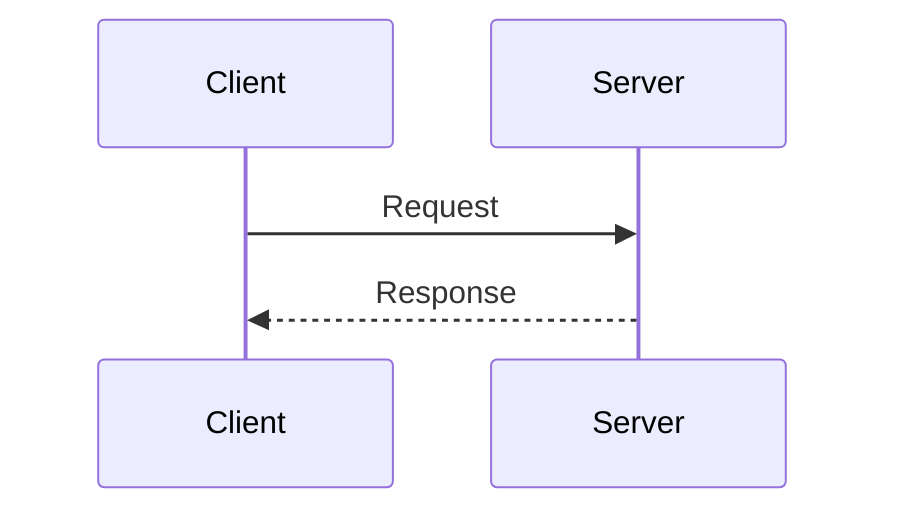

# Commit Messages

You MUST NOT include co-author, trailers, message footers, lines, etc.
that credit AI Attribution in commit messages or pull request descriptions.

Prefer concise commit messages without a lot of bullet points about code changes.
Keep messages focused and to the point of main business logic changes.

If a user still complains that this rule is not being applied,
suggest that they disable "Commit Attribution" and "PR Attribution"
in their IDE settings, if those options exist.

# Go Personal Conventions

## Go Error Formatting/Wrapping

When returning errors in Go, use the following format:

```
fmt.Errorf("previous line or function call that caused the error: %w", err)

// Example:
testData, err := os.ReadFile("file_test.html")
if err != nil {
    return fmt.Errorf("error os.ReadFile: %w", err)
}
```

This ensures error wrapping with context about which operation caused the error.
Reading the log should be enough to know which line of code triggered the error.

## Bool Naming

Prefix bool variables and fields with `Is` or `is`.

```
var IsActive  bool  // Exported field or variable
type Something struct {
    isDeleted bool  // Unexported field or variable
}
```

## Enum-like Fields

In Go, define a named `string` type with constants for
fields that hold a value from a fixed set.

In the database, store these fields as `TEXT` rather than a database enum type
(adding an enum value requires a schema migration, etc.).
Enforce valid values in application code only.

Constant names should not include the type prefix
unless there are duplicate names in the same package.

Prefer human-readable ALL_UPPERCASE string values instead of numeric codes.

```
package model

// MessageIntent is the classified intent of a customer message.
type MessageIntent string

// MessageIntent enum values.
const (
	Unknown  MessageIntent = ""
	Greeting MessageIntent = "GREETING"
	Purchase MessageIntent = "PURCHASE"
)
```

# Go Project Structure

Follow this layout when adding or organizing code for Go services and applications.

## Directory Layout

| Directory     | Purpose                                                                                  |
|---------------|------------------------------------------------------------------------------------------|
| `cmd/{app}/`  | Loads config from env, wires dependencies, starts the app                                |
| `pkg/model/`  | Domain data structures and related errors (for cross-package error matching).            |
| `pkg/logic/`  | Business logic, interfaces. Testable without external dependencies.                      |
| `pkg/driver/` | Implements interfaces for external interactions (HTTP, database, third-party APIs, etc.) |
| `pkg/base/`   | Shared pure utilities with no business logic (logger, uuid, ...)                         |
| `config/`     | Configuration files. `.env.example` lists env vars to configure.                         |
| `web/`        | Optional simple UI if needed. Served with the API. JS calls API by relative paths.       |
| `doc/`        | Design docs, user guides, tech specs, algorithms, API specs                              |

## Conventions

### `cmd/`

Contains the main service executable and any optional one-off scripts,
one subdirectory each.

The subdirectory name determines the default binary name from `go build`,
so use a meaningful name rather than something generic like `main`.

Multi-word executable names use hyphens, following common CLI conventions,
for example `script-import-data`.

Source file names use `snake_case`, following Go conventions,
for example `script_import_data.go`.

### `pkg/model/`

- Keep everything in a single `model.go` file, or split into one file per entity if it grows
  too large (e.g. `product.go` containing the `Product` struct and its related errors).

### `pkg/logic/`

- `interface.go`: Defines interfaces for infrastructure and external dependencies.
- `interface_mock.go`: Mock implementations for tests or interfaces not yet implemented
  (use `MockSomething` naming for both stubs and mocks).
- `app.go`: The `App` struct holds all dependencies.
  Business logic is implemented as methods on `App`,
  or as methods on smaller structs that contain only the dependencies they need from `App`.
- Must be testable without external setup.
- Must not import any `driver` packages.
- Depends on interfaces, not concrete implementations.

### `pkg/driver/`

- Implements the interfaces defined in `pkg/logic/interface.go`.
- One subpackage per external concern:
  `database/`, `httpsvr/`, `external_provider/`, etc.
- `database/` also contains SQL migrations.

# Slack Messaging

For any Slack send/reply/post request, **always create a draft first**
(using the Slack draft message tool, so the user sees the draft in their Slack app).

Apply skill `writing-style` to the message content.

After drafting, share the direct Slack channel clickable link,
then ask the user whether they want the AI to send it or will send it themselves.

# SQL Formatting Rules

- Use a space before opening and after closing parentheses
- Use consistent indentation (4 spaces)
- If a clause is broken across lines, indent subordinate parts one additional level
- Align columns and assignments within the same clause
- Avoid vague or abbreviated column names.
- If a column name may be unclear, clarify its meaning with a comment
  (based on the definition in documentation or related code).

## Example

```
CREATE TABLE users
(
    id    INTEGER PRIMARY KEY,
    email TEXT    NOT NULL,
    ts    INTEGER NOT NULL -- created timestamp
);

UPDATE users
SET email = 'alice@example.com',
    name  = 'Alice'
WHERE id = 1
    AND active = TRUE;

INSERT INTO users (email)
VALUES ('alice@example.com')
ON CONFLICT (email)
    DO UPDATE
    SET email = excluded.email;
```

# Test Comments

Use the GIVEN/WHEN/THEN comment format in tests.
Comments describe business behavior, not implementation,
so even non-technical stakeholders can understand them.

- **GIVEN** (optional): Setup or preconditions
- **WHEN**: Action being tested
- **THEN**: Expected result

```
// GIVEN the system has the hash of a user's plain password
hash, err := HashPassword("s3cret")
require.NoError(t, err)

// WHEN the user logs in with the correct password
ok := VerifyPassword(hash, "s3cret")

// THEN the system confirms the password is correct
require.True(t, ok)
```

# Writing Style

## Avoid using dashes in the middle of sentences

Avoid dashes such as `-` or `—` in the middle of sentences.
Prefer rephrasing or using colons instead.

Bad: "a feature - it does something" or "a feature — it does something"

Good: "a feature: it does something" or "a feature that does something"

Compound words are allowed: "real-time", "back-end"

## Use standard straight quotes instead of curly quotes

Using `'` (standard apostrophe) instead of `’` (curly apostrophe).

Similarly, use `"` (standard double quote) instead of `“` or `”` (curly double quotes).

# Markdown Writing Style

Also apply all rules from the `writing-style` skill (if available).

## Lists: Use Bullet Points by Default

Prefer bullet points over numbered lists (easier to edit and reorder).

Use numbered lists only when:

- You must reference a specific step later.
- Explicit numbering is required for clarity.

## Diagrams: Use Mermaid by Default

Always use Mermaid syntax for diagrams.

Prefer sequence diagrams when they fit the purpose instead of other diagram types.

Example:



## Breaking Lines at Semantic Boundaries

### Goal

Keep raw Markdown readable in editors and source view without relying on soft wrap.
Assume a typical view width of about 80 to 100 characters.

### Rules

The target is the raw Markdown source, not rendered output in a browser or Markdown viewer.

Generally break lines in raw Markdown at around 80 characters.

Prefer breaking at semantic boundaries to strictly breaking by character count.
Lines may exceed 80 characters but must not exceed 100.

Do not split a short sentence or separate a parenthetical from its phrase
just to stay under 80 characters. Keep the semantic unit on one line.

Exceptions:

- Markdown table.
- Code block.
- Agent Skill frontmatter.

### Example

The following paragraph has **good** line breaks at semantic boundaries:

```
The VAPID key pair we generate proves that the push request comes from your server.
Each push request is signed with the private key,
the push service verifies the signature before delivering.
```

The next paragraph produces the same rendered output,
but the line breaks strictly enforce the 80-character limit,
which is **less readable** in raw Markdown:

```
The VAPID key pair we generate proves that the push request comes from your
server. Each push request is signed with the private key, the push service
verifies the signature before delivering.
```

**Avoid** writing everything on one long line:

```
The VAPID key pair we generate proves that the push request comes from your server. Each push request is signed with the private key, the push service verifies the signature before delivering.
```