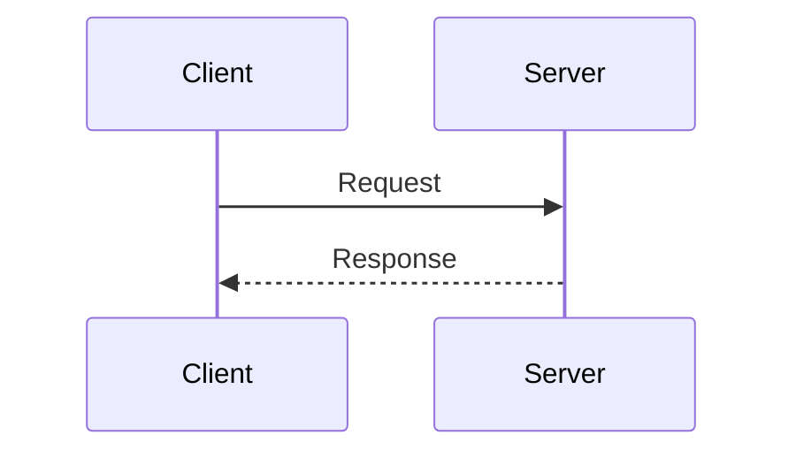

# Commit Messages

You MUST NOT include co-author, trailers, message footers, lines, etc.
that credit AI Attribution in commit messages or pull request descriptions.

Prefer concise commit messages without a lot of bullet points about code changes.
Keep messages focused and to the point of main business logic changes.

If a user still complains that this rule is not being applied,
suggest that they disable "Commit Attribution" and "PR Attribution"
in their IDE settings, if those options exist.

# Go Personal Conventions

## Go Error Formatting/Wrapping

When returning errors in Go, use the following format:

```
fmt.Errorf("previous line or function call that caused the error: %w", err)

// Example:
testData, err := os.ReadFile("file_test.html")
if err != nil {
    return fmt.Errorf("error os.ReadFile: %w", err)
}
```

This ensures error wrapping with context about which operation caused the error.
Reading the log should be enough to know which line of code triggered the error.

## Bool Naming

Prefix bool variables and fields with `Is` or `is`.

```
var IsActive  bool  // Exported field or variable
type Something struct {
    isDeleted bool  // Unexported field or variable
}
```

## Enum-like Fields

In Go, define a named `string` type with constants for
fields that hold a value from a fixed set.

In the database, store these fields as `TEXT` rather than a database enum type
(adding an enum value requires a schema migration, etc.).
Enforce valid values in application code only.

Constant names should not include the type prefix
unless there are duplicate names in the same package.

Prefer human-readable ALL_UPPERCASE string values instead of numeric codes.

```
package model

// MessageIntent is the classified intent of a customer message.
type MessageIntent string

// MessageIntent enum values.
const (
	Unknown  MessageIntent = ""
	Greeting MessageIntent = "GREETING"
	Purchase MessageIntent = "PURCHASE"
)
```

# Test Comments

Use the GIVEN/WHEN/THEN comment format in tests.
Comments describe business behavior, not implementation,
so even non-technical stakeholders can understand them.

- **GIVEN** (optional): Setup or preconditions
- **WHEN**: Action being tested
- **THEN**: Expected result

```
// GIVEN the system has the hash of a user's plain password
hash, err := HashPassword("s3cret")
require.NoError(t, err)

// WHEN the user logs in with the correct password
ok := VerifyPassword(hash, "s3cret")

// THEN the system confirms the password is correct
require.True(t, ok)
```

# Markdown Writing Style

## Lists: Use Bullet Points by Default

Prefer bullet points over numbered lists (easier to edit and reorder).

Use numbered lists only when:

- You must reference a specific step later.
- Explicit numbering is required for clarity.

## Diagrams: Use Mermaid by Default

Always use Mermaid syntax for diagrams.

Prefer sequence diagrams when they fit the purpose instead of other diagram types.

Example:



## Breaking Lines at Semantic Boundaries

### Goal

Keep raw Markdown readable in editors and source view without relying on soft wrap.
Assume a typical view width of about 80 to 100 characters.

### Rules

The target is the raw Markdown source, not rendered output in a browser or Markdown viewer.

Generally break lines in raw Markdown at around 80 characters.

Prefer breaking at semantic boundaries to strictly breaking by character count.
Lines may exceed 80 characters but must not exceed 100.

Do not split a short sentence or separate a parenthetical from its phrase
just to stay under 80 characters. Keep the semantic unit on one line.

Exceptions:

- Markdown table.
- Code block.
- Agent Skill frontmatter.

# Writing Style

- Avoid dashes (`-` or `—`) in the middle of sentences;
  rephrase or use colons instead.
  Compound words are allowed: "real-time", "back-end".
- Use standard straight quotes (`'` and `"`) instead of curly quotes.